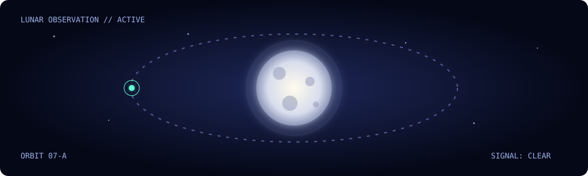
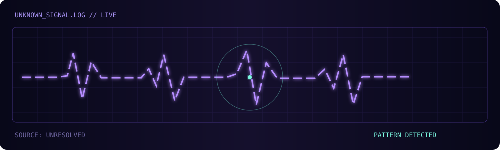
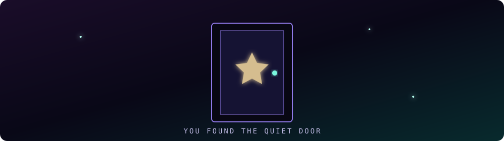

  

 

  <kbd>SELECT A FILE TO OPEN</kbd>

 

  
<code>🌙 MOON.EXE</code> &nbsp; Lunar observation channel

   
  

    
  

  
<code>🐠 AQUARIUM.APP</code> &nbsp; A quiet place under the surface

   
  

    
  

  
<code>📡 UNKNOWN_SIGNAL.LOG</code> &nbsp; Decode the transmission

   
  

    
  

  
<code>📁 DO_NOT_OPEN</code> &nbsp; Permission denied

   
  

    
  

 

  △ MIDNIGHT SYSTEM · CHANNEL 07 · STILL LISTENING △

